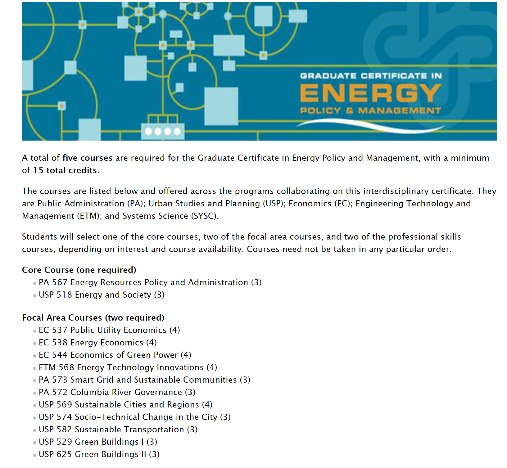

```{r setup, include=FALSE}
knitr::opts_chunk$set(echo = FALSE, cache=TRUE)
 
```

# Who We Are

+ Small, 12 person, Department at PSU https://www.pdx.edu/econ/faculty-staff
+ Hiring an econometrician and applied micro person right now.
+ We tend to focus on Environmental Economics, including Energy, and Health Economics.
+ Portland is a larger version of Bellingham...
    + with better public transit
    + higher rents
    + better opportunity for many enthusiasms.
    + Large body of employers

# Connections

+ Strong history in Energy industry
    + PGE
    + Northwest Natural
    + Pacificorp
    + Seattle City Light
    + BPA
    + PUC
    + Energy Trust of Oregon
    + Northwest Energy Efficiency Alliance
    + Northwest Power & Conservation Council 
    + Consultancy hub
        + Cadmus
        + Research Into Action
    + A few energy managers    

# Also Health

+ Providence
+ Kaiser
+ OHSU

# and Government

+ Secretary of State Office
+ Legislative Staff
+ Oregon Department of Economic Analysis https://oregoneconomicanalysis.com/author/oregoneconomicanalysis/

# Ph.D. Placements

We have about one student per year go to Ph.D.  

Most Recently:

+ Michigan State
+ U of Illinois Chicago
+ UW
+ Carnegie Mellon

# In Short

People do things after they leave.


# Programs

+ MS/MA
+ Graduate Certificates
    + Energy Policy
    + Econometrics (Next Year)
    
# MA/MS Economics

+ 3 terms Micro
+ 3 terms Metrics
+ 2 terms Macro
+ Electives

Generally known for having a strong metrics program.

+ Students will frequently take a MS in Applied Statistics at the same time.
+ Math has a rather famous game theoretician. 

# Energy Policy Certificate



# Funding

Graduate Certificates typically do not come with funding

We usually fund the majority of incoming graduate students:

+ Graduate assistantships
+ Tuition remission
+ 15 hours of work per week.
+ ~$15 per hour

# Second Year Students are Frequently Hired by NERC

The Northwest Economic Research Center

+ Huge variety of topics
+ Run by Tom Potiowsky, former chief state economist.

https://www.pdx.edu/nerc/about-nerc

Amazing experience.


# Seminars

+ Typically about 5 per term on various topics
+ Irregular Brown Bag Series 
    + Tend to be more technical
    + Faculty centered
    + Some local, but off-campus, people

# Applications

+ Due Date Feb 1
+ GREs
+ Letters of Recommendation
+ Statement of Purpose.
+ Lower Bar on Math is:
    + Linear algebra
    + Ordinary Differential Equations
    + Ph.D. basically requires minor in math these days. Interested students frequently take more classes.

# QUESTIONS
