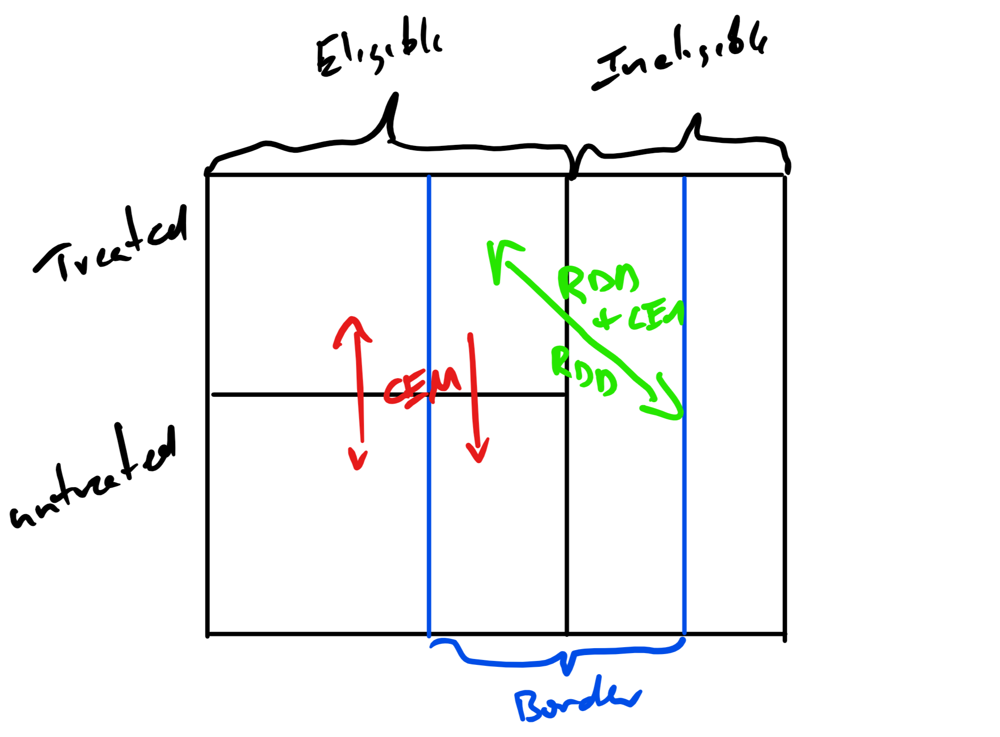

```{r setup, include=FALSE}
knitr::opts_chunk$set(echo = FALSE, cache=TRUE)
 
```

# Abstract

Bla

This is early work.  Still much to do.

# History of Current Work

+ Noticed this when we made SB 1149 improvements on our schools.
+ Gave topics to 	John Bauer, Timothy Hulseman, Virgina Saraswati in Winter 2017 as a topic in Energy Economics
+ They learned enough econometrics and did a good enough job to present at an engineering conference.
+ This takes a different approach to the same topic.

# Background

+ Cost effectiveness evaluation requires an evaluation of _all_ costs and _all_ benefits.
+ Not all jurisdictions use "participant benefits" in evaluation of cost effectiveness because they are not enjoyed by the rate payer.  
+ The "National Efficiency Screening Project" only gives guidance on including non-energy benefits as it explains the symmetry principal, "If you include participant benefits, include participant costs".
+ Some jurisdictions, e.g., The Energy Trust of Oregon, are reducing the technical complexity of evaluations to _reduce evaluation costs_

# "Reduced Technical Complexity"

+ Free ridership/drivership by survey, "Would you have done this without ETO incentives?"
    + Assume people tell the truth.
    + Economists don't believe that.
+ Simpler econometrics
    + No accounting for self-selection bias.
    + No accounting for sampling bias.
    + Stops  'futzing'
    
In short, the opposite of what economics is doing with program evaluation, but more inline with engineering approach.

# Why the Effect of Energy Efficency on Education is Interesting

+ Decisions to improve structures is a financial decision -- money saved on energy.
+ No financial gain, not allowed to participate.

Improvements in student/staff health and the lifetime effects of academic performance dwarf the value of energy savings.

# Daylighting (Sampling)

+ D. A. Kleiber and others. “Environmental Illumination and Human
Behavior: The Effects of Spectrum of Light Source on Human Performance in a
University Setting.” (1973)
    + 3 schools  
    + Movement to portables.
    + 17% drop

+ L. Heschong. “Daylighting in Schools: An Investigation into the
Relationship between Daylighting and Human Performance. Detailed Report.”
(1999).
    + "Data indicate students with the most classroom daylighting progressed 20 percent faster on math tests and 26 percent on reading tests in one year than those with the least."
    + No control for self-selection
    + ~20,000 schools

# 

+ L. Heschong, R. L. Wright and S. Okura. “Daylighting impacts on human
performance in school”. In: _Journal of the Illuminating Engineering
Society_ 31.2 (2002), pp. 101-114.
    + Positive effect. Scale is dubious.
    + Multiple school districts with various quality of daylighting.
    

+ M. H. Nicklas and G. B. Bailey. “Analysis of the Performance of
Students in Daylit Schools.” (1996).
    + "... [daylit] schools outperformed students attending artificially lighted
schools by 5 to 14 percent."

# Indoor Air Quality (Sampling)

+ M. J. Mendell and G. A. Heath. “Do indoor pollutants and thermal
conditions in schools influence student performance? A critical review of
the literature”. In: _Indoor air_ 15.1 (2005), pp. 27-52.
    + Not all that critical (Three studies of students, x2 from 70s)
    + Summary, something is there but we don't know what it is.

+ S. Moonie, D. A. Sterling, L. W. Figgs, et al. “The relationship
between school absence, academic performance, and asthma status”. In:
_Journal of School Health_ 78.3 (2008), pp. 140-148.
    + 3K students
    + More absences, lower test scores.
    + Asthma kids have more absences but not lower scores with same absences.

#

+ U. Haverinen-Shaughnessy, D. Moschandreas and R. Shaughnessy.
“Association between substandard classroom ventilation rates and students’
academic achievement”. In: _Indoor air_ 21.2 (2011), pp. 121-131.
    + Schools with less than 7.1 l/s/person, i.e., less than ASHRAE Standard 62 in 2004.
    + "...[1 l/s per person] increase in the ventilation rate within that range, the proportion of students passing standardized test (i.e., scoring satisfactory or above) is expected to increase by 2.9% (95%CI 0.9–4.8%) for math and 2.7% (0.5–4.9%) for reading."

# In Short

+ Students got stuck in the 60s-70s air conditioning daylighting vs air conditioning battle.
+ Air quality is important but we don't know exactly what part
    + Keep in mind that allergenic mold concentrations, colony forming bodies per liter, can change by factor of 10 in a few hours.
    + Hard to measure.
      
# Why Oregon Schools?

+ Nice features that remove many, but not all, self-selection problems.
+ Decision making cutoffs are based on energy savings, not educational outcomes.

+ Still problems
    + Data shortcoming ... as we go along.
    + Standardized tests are not standard from year-to-year.
    + Building data is not so important to departments of education.

Now, on to the data ...

# SB 1149

+ [SB 1149 (1999)](https://www.oregonlegislature.gov/bills_laws/lawsstatutes/1999orLaw0865.html) was Oregon's deregulation bill.
    + It was part of the implementation of FERC 888.
    + Established a public purpose charge that funds thing like The Energy Trust of Oregon.
+ The 3% Public Purpose Charge was collected by _almost_ all the IOUs.
    + Pacificorp and PGE collect, but Idaho Power in Eastern Oregon does not.
    + Used for Energy Efficiency
    + 10% must be used in schools.
    
# Schools Program    

Schools using SB 1149 public purpose funds:

+ Complete energy audits of _buildings_, not districts, served by Pacificorp or PGE (with limitations);
+ Audits must be completed by an approved audit company;
+ Implement the approved Energy Efficiency Measures identified in the audits;
+ Report Energy Use Index data in the Schools Interactive Database each year; 


# Key Points

+ Not all districts are eligible.
+ Not all schools within districts are eligible.


Makes it easier to establish a natural control group for any treated school by using others in the district.

# Educational Funding in Oregon

Oregon Educational Funding has key provisions that makes using schools in other district more attractive than other states.

+ 1991 Oregon establishes an Equalization Formula:
    + The legislature establishes a biennial K12 State School Fund Budget
    + The State School Fund budget is distributed equally by student across the state, but adjusted for property tax collections.
    + $1 increase in property tax collected results in $1 less in State School Fund support.
    + Measure 5 and 50 property tax limitations put most of the power with the legislature.
    
# School Funding Result
    
Equal, per-student, funding across the state with a few exceptions:

+ Short-term, 3 year, property tax operating levies.
+ Capital bonds
+ A few, depends on year, school districts with few students but lots of taxable property.

Much smaller inter-district funding differences than other states.

# School District Size

+ Oregon has 197 school districts for ~500K students.
    + Washington has 296 for ~1M students
+ The three largest school districts, Portland Public, Salem-Keizer, and  Beaverton are about 40K each.
    + Washington has 9 over 20K
+ The remainder are small.

Less opportunity for intra-district funding differences but need to watch the big three.

# Key Points

+ Management and salary levels may be different across districts 
+ There are fewer haves and have nots within and between districts than other states.

We can feel more comfortable using schools out of district for controls given equal funding.

# The Energy Efficiency Measures (EEMs)

Mostly what you would expect

+ Building Envelope, including windows and insulation.
+ HVAC Components  
+ HVAC Controls
+ Pumps, Motors and Drives
+ Domestic Hot Water
+ Lighting
+ Kitchen Equipment
+ Other (Pool Covers ...)

# What Should Strike you About the List

+ Most of the items you would never notice unless you were an expert looking  or listening for them.
+ There are a few that could have an impact on the educational environment.
    + Double or Triple Glazed Windows (Sound, Moisture Control)
    + Cavity Insulation (Sound, Moisture Control)
    + Lighting Quality Improvements (Daylighting)


# Key Points

+ Treated schools may or may not have educationally impactful EEMs.
+ Treated schools could have a mix.

The non-impactful EEMs can provide a placebo effect robustness check on the effects of the impactful EEMs on educational performance.

# How to Measure Educational Impact

+ Some of the measures produce environmental improvements, less moisture, mold, we can look at the effect on attendance.
    + Recorded annually for each school.
    + Intermediate indicator.  The more often you go to school the better you do.
+ Environmental Improvements can reduce teacher absenteeism.
    + Must be acquired district-by-district and year-by-year.
+ Some produce better learning environments, less distraction.  We can use the annual standardized testing results.
    + Everyone in the same grade takes the same test, but the test, and the levels can be different from year-to-year.

# Key Points

+ Test scores are the main indicator but for some EEMs, absenteeism and attendance _may_ be good predictors.
+ We have some candidates for instruments if we wish to take that route.


# Data Details

# Schools Program Audit Requirements

+ Non-educational buildings and those that are rented or will close in 5 years are ineligible.
+ Energy Audits are required
    + Whole Building audits, similar to ASHRAE Level 2.  Identify EEMs with 50 year payback or less.
    + Multi-component payback is allowed
    + Targeted Audits are acceptable for limited scope.
    + Target is 47/48 kBTU/SF/Year for elementary and 61/62 kBTU/SF/Year for High Schools 
+ Multi-competent payback calculations are allowed.

# School Program Implementation

+ The maximum amount of PPC funds reimbursed will be capped at the total annual savings multiplied by the Measure Life caped at cost.
+ Common for some cost to not be funded.
+ Commissioning is required for:
    + All boiler or chiller measures exceeding $100,000
    + All other HVAC measures and all HVAC controls measures exceeding $50,000
    + All lighting control measures exceeding $100,000
    + Other measures in which commissioning is critical for successful implementation and operation of the measure, as deemed appropriate by the auditor.

# Required Annual Reporting

+ Annual energy expenses by fuel type
+ Square footage
+ Hours of operation

# Summary of Measures

```{r InstallByYear, echo=FALSE, message=FALSE, warning=FALSE, paged.print=FALSE}
EEMs <-read.csv("https://docs.google.com/spreadsheets/d/15X3x4KCEx2-_JYLjq3gXhqS33EKBscW_LLPO-MggDFk/pub?gid=1734037341&single=true&output=csv")

library(dplyr)
library(knitr)

EEMs %>% select(Year  = ImplementedYear) %>% 
  group_by(Year) %>%
   summarize(Installations = n()) %>%
  kable()
```

Note spikes in installation.

# Types of Installed Measures

```{r InstallTypes, echo=FALSE, message=FALSE, warning=FALSE, paged.print=FALSE}
EEMs %>% select(EEM = MeasureClassDetailDescription) %>%
  group_by(EEM) %>%
  summarize(Installations = n()) %>% 
  kable()

```

# Comments

+ Controls are frequently occupancy sensors and day-lighting controls
+ Fixtures are described in detail later as gym, exterior, etc.
+ Note that there are large enough numbers of educationally effective and placebo EEMs.
+ Each EEM was categorized as either Educationally Effective or Placebo.
    + Exterior, gym, and other non-instructional areas are all placebo.
    + Classroom lighting and controls, shell,  window and ventilation improvmenents are all effective.

# Electric Utilities


# Oregon is a mix

+ Most of population is served by IOUs
+ Large tracts of COUs
+ Only Pacificorp and PGE schools are eligible.

# Districts with Eligible Schools

```{r BuildBorderDistricts, echo=FALSE, message=FALSE, warning=FALSE, paged.print=FALSE}

AllSchools <- read.csv("https://docs.google.com/spreadsheets/d/1WXNu3cNY4DyZ7yWXT2MPd3bd61M0Vmo2ty62Uux1TZU/pub?gid=1048793783&single=true&output=csv")
library(dplyr)
library(stringr)


AllSchools %>% 
  mutate(Charter = str_detect(School.Name, "Charter")) %>%
  mutate(Immersion = str_detect(School.Name, "Immersion")) %>%
  mutate(Magnet = str_detect(School.Name, "Magnet")) -> AllSchools

AllSchools %>% 
  filter (Charter == FALSE & Immersion == FALSE  & Magnet == FALSE) -> AllSchools

AllSchools %>%
  mutate(SpecialPurge = str_detect(Notes, "Housed at") |
           str_detect(Notes, "shared campus") |
           str_detect(Notes, "not own") | 
           str_detect(Notes, "not owned")) -> AllSchools

AllSchools %>% 
  filter (SpecialPurge == FALSE) -> AllSchools

AllSchools %>% 
  group_by(District.ID, District.Name) %>%
  count(SB.1149.Eligibility) %>%
  group_by(District.ID, District.Name) %>%
  count() %>%
  filter(nn >1) -> BorderDistricts
```

```{r MapBoarderDistricts, echo=FALSE, message=FALSE, warning=FALSE, paged.print=FALSE}

# library(maptools)
# Sto <- gpclibPermit()
# 
# Schools <- readShapePoly("../MapData/cb_2016_41_unsd_500k/cb_2016_41_unsd_500k.shp")
# 
# library(ggmap)
# 
# mapImage <- get_map(location = "oregon", zoom = 7, maptype = "toner")
# 
# 
# library(RColorBrewer)
# colors <- brewer.pal(9, "BuGn")
# 
# # Subset SchoolBound so only eligible districts
# # 
# 
# 
# Split <- function(x) { last(str_split(x, boundary("word"))[[1]])
# }
# 
# SplitV <- Vectorize(Split)
# 
# 
# 
# DistNumbers <- SplitV(as.character(BorderDistricts$District.Name))
# 
# # Fix so that only the eligible districts show.
# #Schools@data$NAME
# 
# SchoolBound <- fortify(Schools)
# 
# 
# ggmap(mapImage) 
# # +
# #   geom_polygon(aes(x = long,
# #                    y = lat,
# #                    group = group),
# #                data = SchoolBound,
# #                color = colors[9],
# #                fill = colors[6],
# #                alpha = 0.5) +
# #   labs(x = "Longitude",
# #        y = "Latitude")
# # 

```

 
# How Many District? Schools? (2016)

```{r EligibleSchools, message=FALSE, warning=FALSE, include=FALSE, paged.print=FALSE}

AllSchools <- read.csv("https://docs.google.com/spreadsheets/d/1WXNu3cNY4DyZ7yWXT2MPd3bd61M0Vmo2ty62Uux1TZU/pub?gid=1048793783&single=true&output=csv")

AllSchools %>% 
  mutate(Charter = str_detect(School.Name, "Charter")) %>%
  mutate(Immersion = str_detect(School.Name, "Immersion")) %>%
  mutate(Magnet = str_detect(School.Name, "Magnet")) -> AllSchools

AllSchools %>% 
  filter (Charter == FALSE & Immersion == FALSE  & Magnet == FALSE) -> AllSchools

AllSchools %>%
  mutate(SpecialPurge = str_detect(Notes, "Housed at") |
           str_detect(Notes, "shared campus") |
           str_detect(Notes, "not own") | 
           str_detect(Notes, "not owned")) -> AllSchools

AllSchools %>% 
  filter (SpecialPurge == FALSE) -> AllSchools

AllSchools %>% 
  group_by(District.ID, District.Name) %>%
  count(SB.1149.Eligibility) %>%
  group_by(District.ID, District.Name) %>%
  count() %>%
  filter(nn >1) -> BorderDistricts

AllSchools %>%
  inner_join(BorderDistricts) -> BorderSchools

EEMs %>% 
  select(FacilityODEId) %>%
  unique() -> TreatedSchoolIDs

TreatedSchoolIDs$Treated <- TRUE

left_join(BorderSchools, TreatedSchoolIDs, by = c("School.ID" = "FacilityODEId" )) %>%
  mutate(Treated = if_else(Treated == TRUE, TRUE, FALSE, missing=FALSE)) -> BorderSchools
  
BorderSchools %>% 
  filter(Treated == TRUE) %>%
  group_by(District.ID, District.Name) %>%
  count(Treated) %>% 
  filter(n >0) %>%
  select(District.ID,District.Name)-> WithTreated

BorderSchools %>%
  semi_join(WithTreated) -> TreatedDistrictSchools

##
AllSchools %>% 
  filter(SB.1149.Eligibility == "YES") %>%
  select(District.ID) %>%
  unique() %>%
  nrow() -> EligibleDistricts

AllSchools %>% 
  filter(SB.1149.Eligibility == "YES") %>%
  select(School.ID) %>%
  unique() %>%
  nrow() -> EligibleSchools
```

+ Eligible 
    + Districts: `r EligibleDistricts` 
    + Schools: `r EligibleSchools`
+ Border (Eligible and ineligible schools in district)
    + Districts: `r nrow(BorderDistricts)`
    + With treated schools: `r nrow(WithTreated)`
+ Schools in Border Districts : `r nrow(BorderSchools)`
    + Eligible untreated: `r  table(BorderSchools$SB.1149.Eligibility)[2] - table(BorderSchools$Treated)[2]`
    + Eligible treated: `r table(BorderSchools$Treated)[2]`
    + Ineligible: `r table(BorderSchools$SB.1149.Eligibility)[1]`
+ Schools in Border Districts with treated schools : `r nrow(TreatedDistrictSchools)`
    + Eligible untreated: `r  table(TreatedDistrictSchools$SB.1149.Eligibility)[2] - table(TreatedDistrictSchools$Treated)[2]`
    + Eligible treated: `r table(TreatedDistrictSchools$Treated)[2]`
    + Ineligible: `r table(TreatedDistrictSchools$SB.1149.Eligibility)[1]`    

 
```{r LoadFreeReducedData, message=FALSE, warning=FALSE, include=FALSE, paged.print=FALSE}

library(readr)

FreeReduced <- read_csv("../FreeReducedLunch/StudentsEligibleforFreeorReducedLunc46.CSV")

library(dplyr)

FreeReduced$Year <- as.numeric(substr(FreeReduced$SCHLYR, nchar(FreeReduced$SCHLYR) - 3, nchar(FreeReduced$SCHLYR)))


FreeReduced %>%
  select( SchoolID  = SCHLINSTID, DistrictID  = DISTINSTID,  FreeLunchPercent = FREEREDLNCHPCT, District = DISTNM, School= SCHLNM, Year  ) -> FreeReduced

## Diagnostics

# FreeReduced %>%
#   group_by(SchoolID) %>%
#   summarise(n = n(), StartYear = min(Year), EndYear = max(Year)) %>%
#   View()

```
 
 
```{r LoadAttendanceData, message=FALSE, warning=FALSE, include=FALSE, paged.print=FALSE}
 
# Read the separate files
# 
library(readxl)

Attendance13 <- read_excel("../Attendance/amo-attendance_1213.xls", sheet = "Attendance Data")
Attendance14 <- read_excel("../Attendance/amo-attendance_1314.xlsx", sheet = "Attendance Data")

Attendance15 <- read_excel("../Attendance/attendance_1415.xlsx")
Attendance16 <- read_excel("../Attendance/attendance_1516.xlsx")
Attendance17 <- read_excel("../Attendance/attendance_1617.xlsx")

# Add year to each
Attendance13$Year <- 2013
Attendance14$Year <- 2014
Attendance15$Year <- 2015
Attendance16$Year <- 2016
Attendance17$Year <- 2017

Attendance13 <- Attendance13 %>%
  filter(Subgroup == "All Students", `School/District` == "School") 

Attendance14 <- Attendance14 %>%
  filter(Subgroup == "All Students", `School/District` == "School") 

Attendance15 <- Attendance15 %>%
  filter( `Institution\r\nType` !="District", `Student Group` == "All Students")

Attendance16 <- Attendance16  %>%
  filter( `Institution\r\nType` !="District", `Student Group` == "All Students")

Attendance17 <- Attendance17  %>%
  filter( `Institution\r\nType` !="District", `Student Group` == "All Students")

library(dplyr)
bind_rows(Attendance13, Attendance14) %>%
  select(DistrictID, Distict = `District Name`,  SchoolID = InstID, School = `Institution Name`, Attendance = `Current Attendance Rate`, Year) ->EarlyAttendance

bind_rows(Attendance15, Attendance16, Attendance17)  %>%
  filter(`Student Group` == "All Students") %>%
  select(Distict = `Parent District Name`,  SchoolID = InstID, School = `Institution Name`, Attendance = `Attendance\r\nRate`, Year) -> LateAttendance

# Final Attendance
bind_rows(EarlyAttendance, LateAttendance) %>% unique() -> Attendance


# fix missing district ID for later years
# 

Attendance %>%
  filter(!is.na(DistrictID)) %>%
  select(DistrictID, SchoolID) %>%
  unique() -> DistrictKEY

Attendance %>%
  left_join(DistrictKEY, by = c("SchoolID"),suffix = c(".KILL","")) %>%
  select(-contains(".KILL")) %>%
  mutate(Attendance = as.numeric(Attendance))-> Attendance


remove(Attendance13, Attendance14, Attendance15, Attendance16, Attendance17, EarlyAttendance, LateAttendance, DistrictKEY)

# Diagnostics


```


```{r LoadMembershipData, message=FALSE, warning=FALSE, include=FALSE, paged.print=FALSE}


# Enrollment Reports
# 

library(readxl)

# Read in from local.  Error in http read so resorted to this.

Membership10 <- read_excel("../MembershipReport/fallmembershipreport_20092010.xls", sheet = "School")

Membership11 <- read_excel("../MembershipReport/fallmembershipreport_20102011.xls", sheet = "School (Final)")

Membership12 <- read_excel("../MembershipReport/fallmembershipreport_20112012.xls", sheet = "School (Final)")

Membership13 <- read_excel("../MembershipReport/fallmembershipreport_20122013.xls", sheet = "School (Final)")

Membership14 <- read_excel("../MembershipReport/fallmembershipreport_20132014.xls", sheet = "School (1314)")

Membership15 <- read_excel("../MembershipReport/fallmembershipreport_20142015.xls", sheet = "School (1415)")

Membership16 <- read_excel("../MembershipReport/fallmembershipreport_20152016.xlsx", sheet = "School (15-16)")

Membership17 <- read_excel("../MembershipReport/fallmembershipreport_20162017.xlsx", sheet = "School (16-17)")

#Add year indicator to each dataframe
#
Membership10$Year <- 2010
Membership11$Year <- 2011
Membership12$Year <- 2012
Membership13$Year <- 2013
Membership14$Year <- 2014
Membership15$Year <- 2015
Membership16$Year <- 2016
Membership17$Year <- 2017

# Create common colum names for  data we need
# 

CommonNames1217 <-  c("DistrictID"              
                      ,"District"                                       
                      ,"SchoolID"                
                      ,"School"                                         
                      ,"PrevEnrollment"                       
                      ,"Enrollment"                       
                      ,"Male"                                  
                      ,"PercentMale"                             
                      ,"Female"                                 
                      ,"PercentFemale"                            
                      ,"AmericanIndianAlaskaNative"         
                      ,"PercentAmericanIndianAlaskaNative"    
                      ,"Asian"                                  
                      ,"PercentAsian"                             
                      ,"NativeHawaiianPacificIslander"      
                      ,"PercentNativeHawaiianPacificIslander"
                      ,"AfricanAmerican"                 
                      ,"PercentAfricanAmerican"           
                      ,"Hispanic"                       
                      ,"PercentHispanic"                  
                      ,"White"                                  
                      ,"PercentWhite"                            
                      ,"Multiracial"                            
                      ,"PercentMultiracial"                       
                      ,"Kindergarten"                           
                      ,"GradeOne"                              
                      ,"GradeTwo"                              
                      ,"GradeThree"                            
                      ,"GradeFour"                             
                      ,"GradeFive"                             
                      ,"GradeSix"                              
                      ,"GradeSeven"                            
                      ,"GradeEight"                            
                      ,"GradeNine"                             
                      ,"GradeTen"                              
                      ,"GradeEleven"                           
                      ,"GradeTwelve"                           
                      ,"Year") 


names(Membership12) <- CommonNames1217
names(Membership13) <- CommonNames1217
names(Membership14) <- CommonNames1217
names(Membership15) <- CommonNames1217
names(Membership16) <- CommonNames1217
names(Membership17) <- CommonNames1217

# Only deal with counts not percents
# 
Membership12 %>% select(-contains("Percent")) -> Membership12
Membership13 %>% select(-contains("Percent")) -> Membership13
Membership14 %>% select(-contains("Percent")) -> Membership14
Membership15 %>% select(-contains("Percent")) -> Membership15
Membership16 %>% select(-contains("Percent")) -> Membership16
Membership17 %>% select(-contains("Percent")) -> Membership17

Membership10 %>% select(-contains("%")) -> Membership10
Membership11 %>% select(-contains("%")) -> Membership11


Membership10 %>%
  rename(
    DistrictID = "Attnd\nDistInstID",
    SchoolID = "Attnd\nSchlInstID",  
    Enrollment = "2009-10\nTotal Enrollment",                 
    Male = "2009-10 Male",                                    
    Female ="2009-10\nFemale",                                                      
    AmericanIndianAlaskaNative="2009-10\nAmerican Indian/Alaskan Native\n(Non-Hispanic)",                  
    
    AfricanAmerican= "2009-10\nBlack/African American\n(Non-Hispanic)",
    Hispanic= "2009-10\nHispanic/Latino",                                                 
    White = "2009-10\nWhite\n(Non-Hispanic)",                                           
    Multiracial = "2009-10\nMultiracial\n(Non-Hispanic)",
    
    Kindergarten = "2009-10 Kindergarten",                                                     
    GradeOne = "2009-10 Grade One",                                                        
    GradeTwo = "2009-10 Grade Two",                                                        
    GradeThree = "2009-10 Grade Three",                                                      
    GradeFour = "2009-10 Grade Four",                                                       
    GradeFive = "2009-10 Grade Five",                                                       
    GradeSix = "2009-10 Grade Six",                                                        
    GradeSeven = "2009-10 Grade Seven",                                                      
    GradeEight = "2009-10 Grade Eight",                                                      
    GradeNine = "2009-10 Grade Nine",                                                       
    GradeTen = "2009-10 Grade Ten",                                                        
    GradeEleven = "2009-10 Grade Eleven",                                                     
    GradeTwelve = "2009-10 Grade Twelve",                                                     
    NativeHawaiianPacificIslander = `For Future Reference\n2009-10\nPacific Islander\n(Non-Hispanic)`,
    
    Asian = `For Future Reference\n2009-10\nAsian\n(Non-Hispanic)`
  ) %>%
  select( -contains("2009-10")) -> Membership10

Membership10$PrevEnrollment <- NA

Membership11 %>% 
  rename( DistrictID = "Attending\nDistrict\nInstID",                                                                                       
          SchoolID = "Attending\nSchool\nInstID",                                                     
          PrevEnrollment = "2009-10\nTotal Enrollment",                                                     
          Enrollment = "2010-11\nTotal Enrollment",                                                     
          Male = "2010-11 Male",                                                                  
          Female = "2010-11 Female",                                                                
          AmericanIndianAlaskaNative = "2010-11\nAmerican Indian/Alaskan Native\n(Non-Hispanic)",                       
          
          AfricanAmerican = "2010-11\nBlack/African American\n(Non-Hispanic)",                              
          Hispanic = "2010-11\nHispanic/Latino",                                                      
          White = "2010-11\nWhite\n(Non-Hispanic)",                                                
          Multiracial = "2010-11\nMultiracial\n(Non-Hispanic)",                                          
          Kindergarten = "2010-11\nKindergarten",                                                         
          GradeOne = "2010-11\nGrade One",                                                            
          GradeTwo = "2010-11\nGrade Two",                                                            
          GradeThree = "2010-11\nGrade Three",                                                          
          GradeFour = "2010-11\nGrade Four",                                                           
          GradeFive = "2010-11\nGrade Five",                                                           
          GradeSix = "2010-11\nGrade Six",                                                            
          GradeSeven = "2010-11\nGrade Seven",                                                          
          GradeEight = "2010-11\nGrade Eight",                                                          
          GradeNine = "2010-11\nGrade Nine",                                                           
          GradeTen = "2010-11\nGrade Ten",                                                            
          GradeEleven = "2010-11\nGrade Eleven",                                                         
          GradeTwelve = "2010-11\nGrade Twelve",                                   
          Asian = "For Future Reference\n2010-11\nAsian only\n(Non-Hispanic)", 
          
          NativeHawaiianPacificIslander  = "2010-11\nAsian/Pacific Islander\n(Non-Hispanic)",            
          Year  = "Year" 
  ) %>%   
  select( -contains("2010-11")) -> Membership11

# Enrollment and PrevEnrollment contains notes.  Set those to NA
Membership10$Enrollment <- as.numeric(Membership10$Enrollment)
Membership11$Enrollment <- as.numeric(Membership11$Enrollment)
Membership12$Enrollment <- as.numeric(Membership12$Enrollment)
Membership13$Enrollment <- as.numeric(Membership13$Enrollment)
Membership14$Enrollment <- as.numeric(Membership14$Enrollment)
Membership15$Enrollment <- as.numeric(Membership15$Enrollment)
Membership16$Enrollment <- as.numeric(Membership16$Enrollment)
Membership17$Enrollment <- as.numeric(Membership17$Enrollment)

Membership10$PrevEnrollment <- as.numeric(Membership10$PrevEnrollment)
Membership11$PrevEnrollment <- as.numeric(Membership11$PrevEnrollment)
Membership12$PrevEnrollment <- as.numeric(Membership12$PrevEnrollment)
Membership13$PrevEnrollment <- as.numeric(Membership13$PrevEnrollment)
Membership14$PrevEnrollment <- as.numeric(Membership14$PrevEnrollment)
Membership15$PrevEnrollment <- as.numeric(Membership15$PrevEnrollment)
Membership16$PrevEnrollment <- as.numeric(Membership16$PrevEnrollment)
Membership17$PrevEnrollment <- as.numeric(Membership17$PrevEnrollment)


# Join them
Membership <- bind_rows(Membership10, Membership11, Membership12, Membership13, Membership14, Membership15, Membership16, Membership17) 

# Clean space
remove(Membership10, Membership11, Membership12, Membership13, Membership14, Membership15, Membership16, Membership17, CommonNames1217)


```

```{r LoadTestScores, message=FALSE, warning=FALSE, include=FALSE, paged.print=FALSE}

# Source http://www.ode.state.or.us/data/reportcard/Media.aspx


# Read in

Schools16 <- read.csv("http://www.ode.state.or.us/data/reportcard/media/17/RCmediaSchoolsAggregate.csv")

Schools15 <- read.csv("http://www.ode.state.or.us/data/reportcard/media/16/RCmediaSchoolsAggregate.csv")

Schools14 <- read.csv("http://www.ode.state.or.us/data/reportcard/media/15/RCmediaSchoolsAggregate.csv")

Schools13 <- read.csv("http://www.ode.state.or.us/data/reportcard/media/14/RCmediaSchoolsAggregate.csv")

Schools12 <- read.csv("http://www.ode.state.or.us/data/reportcard/media/13/RCmediaSchoolsAggregate.csv")

Schools11 <- read.csv("http://www.ode.state.or.us/data/reportcard/media/12/RCmediaSchoolsAggregate.csv")

Schools10 <- read.csv("http://www.ode.state.or.us/data/reportcard/media/11/RCmediaSchoolsAggregate.csv")


# Normalize Columns

Schools16 %>%
  mutate(Year = 2016) %>%
  select(DistrictID = District.ID, 
         SchoolID = School.ID, 
         Year,
         Type = School.Type,
         ELA = ELA.Pct.Met.2015.16,
         Math = Math.Pct.Met.2015.16,
         Science = Science.Pct.Met.2015.16) -> Schools16

Schools15 %>%
  mutate(Year = 2015) %>%
  select(DistrictID = District.ID, 
         SchoolID = School.ID, 
         Year,
         Type = School.Type,
         ELA = ELA.Pct.Met.2014.15,
         Math = Math.Pct.Met.2014.15,
         Science = Science.Pct.Met.2014.15) -> Schools15

Schools14 %>%
  mutate(Year = 2014) %>%
  select(DistrictID = District.ID, 
         SchoolID = School.ID, 
         Year,
         Type = School.Type,
         Reading = Reading.Pct.Met.2013.14,
         Writing = Writing.Pct.Met.2013.14,
         Math = Math.Pct.Met.2013.14,
         Science = Science.Pct.Met.2013.14) -> Schools14

Schools13 %>%
  mutate(Year = 2013) %>%
  select(DistrictID = District.ID, 
         SchoolID = School.ID, 
         Year,
         Type = School.Type,
         Reading = Reading.Pct.Met.2012.13,
         Writing = Writing.Pct.Met.2012.13,
         Math = Math.Pct.Met.2012.13,
         Science = Science.Pct.Met.2012.13) -> Schools13


Schools12 %>%
  mutate(Year = 2012,DistrictID = NA ) %>%
  select(DistrictID, 
         SchoolID = InstID, 
         Year,
         Type = SchoolType,
         Reading = ReadStudExceedMeetAllGradePct1,
         Writing = WriteStudExceedMeetAllGradePct1,
         Math = MathStudExceedMeetAllGradePct1,
         Science = ScienceStudExceedMeetAllGradePct1) -> Schools12


Schools11 %>%
  mutate(Year = 2011, DistrictID = NA ) %>%
  select(DistrictID, 
         SchoolID = InstID, 
         Year,
         Type = SchoolType,
         Reading = ReadStudExceedMeetAllGradePct1,
         Writing = WriteStudExceedMeetAllGradePct1,
         Math = MathStudExceedMeetAllGradePct1,
         Science = ScienceStudExceedMeetAllGradePct1) -> Schools11


Schools10 %>%
  mutate(Year = 2010, DistrictID = NA ) %>%
  select(DistrictID, 
         SchoolID = InstID, 
         Year,
         Type = SchoolType,
         Reading = ReadStudExceedMeetAllGradePct1,
         Writing = WriteStudExceedMeetAllGradePct1,
         Math = MathStudExceedMeetAllGradePct1,
         Science = ScienceStudExceedMeetAllGradePct1) -> Schools10


TestScores <- bind_rows(Schools10, Schools11, Schools12, Schools13, Schools14, Schools15, Schools16) 
rm(Schools10, Schools11, Schools12, Schools13, Schools14, Schools15, Schools16)

# Fix top, bottom and NA coding

TestScores %>%
  mutate(Reading = as.numeric(case_when(
    Reading == ">95"  ~  "95",
    Reading == "<5" ~ "5",
    Reading == "*" ~ "NA",
    Reading == "--" ~ "NA",
    TRUE ~ Reading))) %>%
  mutate(Writing = as.numeric(case_when(
    Writing == ">95"  ~  "95",
    Writing == "<5" ~ "5",
    Writing == "*" ~ "NA",
    Writing == "--" ~ "NA",
    TRUE ~ Writing))) %>%
  mutate(Math = as.numeric(case_when(
    Math == ">95"  ~  "95",
    Math == "<5" ~ "5",
    Math == "*" ~ "NA",
    Math == "--" ~ "NA",
    TRUE ~ Math))) %>%
  mutate(Science = as.numeric(case_when(
    Science == ">95"  ~  "95",
    Science == "<5" ~ "5",
    Science == "*" ~ "NA",
    Science == "--" ~ "NA",
    TRUE ~ Science))) %>%
  mutate(ELA = as.numeric(case_when(
    ELA == ">95"  ~  "95",
    ELA == "<5" ~ "5",
    ELA == "*" ~ "NA",
    ELA == "--" ~ "NA",
    TRUE ~ ELA))) ->TestScores

# Change to numeric  
TestScores %>%
  mutate(Reading = as.numeric(Reading),
         Writing = as.numeric(Writing),
         Math = as.numeric(Math),
         Science = as.numeric(Science),
         ELA = as.numeric(ELA)) ->TestScores

# Fix High school type
# 

TestScores %>%
  mutate(Type = case_when(
    Type == "HSG" ~ "H",
    Type == "HSA" ~ "H",
    TRUE ~ Type)) ->TestScores

#Fill missing district codes

TestScores %>%
  filter(!is.na(DistrictID)) %>%
  select(DistrictID, SchoolID) %>%
  unique() -> DistrictSchoolPairs

TestScores %>%
  left_join(DistrictSchoolPairs, by = "SchoolID", suffix = c(".KILL","")) %>%
  select(-contains(".KILL")) -> TestScores

rm(DistrictSchoolPairs)  
```

```{r LoadFinance, message=FALSE, warning=FALSE, include=FALSE, paged.print=FALSE}
DistrictFinance <- read.csv("https://s3-us-west-2.amazonaws.com/woodsjeeschools/ActualExpendituresFundFunction30.CSV") 

library(stringr)
library(dplyr)

# This still has ESD numbers in it and they have odd headcounts on students and expenditures.

Membership %>%
  select(DistrictID, Year, Enrollment) %>%
  group_by(DistrictID, Year) %>%
  summarise(DistrictEnrollment = sum(Enrollment, na.rm = TRUE)) -> DistrictEnrollment

DistrictFinance %>%
  mutate(YearBeginning = as.numeric(str_sub(as.character(SchlYr),-4) )) %>%
  mutate(Year = YearBeginning + 1) %>%
  filter(MajFuncDesc == "Instruction" & Amount > 0 & Year > 2009) %>%
  select(DistInstID, Year, Amount) %>%
  group_by(DistInstID, Year) %>%
  summarise(InstExpenditures = sum(Amount, na.rm = TRUE)) %>%
  left_join(DistrictEnrollment, by = c("DistInstID" = "DistrictID", "Year"), suffix = c("", ".KILL")) %>%
  select( -contains(".KILL")) %>%
  filter(DistrictEnrollment > 0) %>%
  mutate(PerStudentExp = InstExpenditures/DistrictEnrollment) -> DistrictFinance

  
```

```{r LoadEEMs, message=FALSE, warning=FALSE, include=FALSE, paged.print=FALSE}

#Read in data
EEMs <-read.csv("https://docs.google.com/spreadsheets/d/15X3x4KCEx2-_JYLjq3gXhqS33EKBscW_LLPO-MggDFk/pub?gid=1734037341&single=true&output=csv")

library(dplyr)
library(knitr)

# Convert cost savings to numeric
EEMs %>%
  mutate(
    ElectricitySave = as.numeric(gsub( "[$,]", "",as.character(Energy.Cost.Savings_Electricity))),
    NGCostSave = as.numeric(gsub( "[$,]", "",as.character(Energy.Cost.Savings_Natural.Gas))),
    DieselCostSave = as.numeric(gsub( "[$,]", "",as.character(Energy.Cost.Savings_Diesel))),
    PropaneCostSave = as.numeric(gsub( "[$,]", "",as.character(Energy.Cost.Savings_Propane))), 
    OilCostSave = as.numeric(gsub( "[$,]", "",as.character(Energy.Cost.Savings_..5.Oil))),
    SteamCostSave = as.numeric(gsub( "[$,]", "",as.character(Energy.Cost.Savings_Steam)))
         ) -> EEMs

EEMs %>%
  rowwise() %>%
  mutate(TotalCostSave =  sum(ElectricitySave, NGCostSave, DieselCostSave, PropaneCostSave, OilCostSave, SteamCostSave, na.rm = TRUE)) -> EEMs

# These are handcoded classifications of the EEMs into placebo and educationally important.
Categorize <- read_csv("https://docs.google.com/spreadsheets/d/e/2PACX-1vQTPacqSITvg9cwb2FqO8heISBbaXyDrzjSTOeYeoLWB0PdnUXYuXokE_TTej6fwemkAakIxuxZukBx/pub?gid=1802982604&single=true&output=csv")

# Merge in categorization and make sure there are no NAs

EEMs<-EEMs %>%
  left_join(Categorize, suffix = c("",".KILL")  ) %>%
  select( - contains(".KILL")) %>%
  mutate(Placebo = if_else(is.na(Placebo), FALSE, TRUE)) %>%
  mutate(Effective = if_else(is.na(Effective), FALSE, TRUE))

#Get the year definitions lined up with test score and other data

EEMs<-EEMs %>%
  mutate(Year = if_else(as.numeric(ImplementedMonth) > 5, as.numeric(ImplementedYear), as.numeric(ImplementedYear) + 1))


# Spread the kind of EEM into types

EEMs %>%
  mutate(   
    Controls =if_else(MeasureClassDetailDescription == "Controls", TRUE, FALSE),
    FixtureMod =if_else(MeasureClassDetailDescription == "Fixture Modification", TRUE, FALSE),
    Boiler =if_else(MeasureClassDetailDescription == "Boiler Equipment", TRUE, FALSE),
    Lamp =if_else(MeasureClassDetailDescription == "Lamp Modification", TRUE, FALSE),  
    Distribution  =if_else(MeasureClassDetailDescription == "Distribution System", TRUE, FALSE),          
    Chiller  = if_else(MeasureClassDetailDescription == "Chiller/AC Equipment", TRUE, FALSE),         
    Insulation  = if_else(MeasureClassDetailDescription == "Insulation", TRUE, FALSE),                   
    Windows  = if_else(MeasureClassDetailDescription == "Windows", TRUE, FALSE),                      
    Other  = if_else(MeasureClassDetailDescription == "Other", TRUE, FALSE),                        
    Maintenance  = if_else(MeasureClassDetailDescription == "Maintenance", TRUE, FALSE),                  
    Flow  = if_else(MeasureClassDetailDescription == "Flow Issues", TRUE, FALSE),                  
    Doors  = if_else(MeasureClassDetailDescription == "Doors", TRUE, FALSE),                        
    HeatRecovery = if_else(MeasureClassDetailDescription == "Heat Recovery Options", TRUE, FALSE)     
    ) -> EEMs

## Compress by site/year with any true yielding true, or
## 
## 

EEMs %>%
  group_by(FacilityODEId, Year) %>%
  summarise(Controls  = any(Controls),
            FixtureMod = any(FixtureMod),
            Boiler = any(Boiler),
            Lamp = any(Lamp),
            Distribution = any(Distribution),
            Chiller = any(Chiller),
            Insulation = any(Insulation),
            Windows = any(Windows),                               
            Other = any(Other),
            Maintenance = any(Maintenance),                     
            Flow = any(Flow),
            Doors = any(Doors),  
            HeatRecovery = any(HeatRecovery),
            Placebo = any(Placebo),
            Effective = any(Effective),
            TotalCostSave = sum(TotalCostSave)
  ) -> EEMSummary


```


```{r MergeAll, message=FALSE, warning=FALSE, include=FALSE, paged.print=FALSE}

FreeReduced %>% 
  filter(Year > 2009) %>%
  left_join(TestScores, by = c("DistrictID", "SchoolID", "Year"), suffix = c("",".KILL")) %>%     
  left_join(Attendance, by = c("DistrictID", "SchoolID", "Year"), suffix = c("",".KILL")) %>%
  left_join(Membership, by = c("DistrictID", "SchoolID", "Year"), suffix = c("",".KILL")) %>%
  left_join(DistrictFinance, by = c("DistrictID" = "DistInstID", "Year"), suffix = c("",".KILL")) %>%
  left_join(EEMSummary, by = c("SchoolID" = "FacilityODEId", "Year"),suffix = c("",".KILL")) %>%
  select(-contains(".KILL")) -> Master

library(tidyr)
# Fix NA to false for those without EEMs
Master %>% 
  replace_na(list(Controls = FALSE,
                  FixtureMod = FALSE,
                  Boiler = FALSE,
                  Lamp = FALSE,
                  Distribution = FALSE,
                  Chiller = FALSE,
                  Insulation = FALSE,
                  Windows = FALSE,
                  Other = FALSE,
                  Maintenance = FALSE,
                  Flow = FALSE,
                  Doors = FALSE,
                  HeatRecovery = FALSE,
                  Placebo = FALSE,
                  Effective = FALSE)) -> Master
  
# 
# Indicator for treated
 
Master %>% 
  mutate(NewlyTreated  = !is.na(TotalCostSave)) -> Master

# And if treated currently or in the past
Master %>%
  arrange(SchoolID, Year ) %>%
  group_by(SchoolID, DistrictID) %>%
  mutate(Treated = cumany(NewlyTreated),
         AnyPlacebo = cumany(Placebo),
         AnyEffective = cumany(Effective)) -> Master

# Add Eligibility

AllSchools <- read.csv("https://docs.google.com/spreadsheets/d/1WXNu3cNY4DyZ7yWXT2MPd3bd61M0Vmo2ty62Uux1TZU/pub?gid=1048793783&single=true&output=csv")

Eligibility <- AllSchools %>%
  select(School.ID, District.ID, Eligible = SB.1149.Eligibility)

Master %>%
  left_join(Eligibility, by = c("SchoolID" = "School.ID", "DistrictID"= "District.ID"), suffix = c("",".KILL")) %>%
  select( -contains(".KILL")) -> Master
  
# Add Ever Treated

Master %>% 
  group_by(SchoolID) %>%
  mutate(EverTreated = any(NewlyTreated)) -> Master

# Add Fractional student population descriptions and logit transform the  response.
#
LogitTransform <- function(x) log((x/100)/(1-(x/100)))


Master %>%
  mutate(MalePct = Male / Enrollment,
         WhitePct = White / Enrollment ,
         AAPct = AfricanAmerican / Enrollment,
         HispanicPct = Hispanic / Enrollment,
         AsianPct = Asian / Enrollment)%>%
  mutate(Attendance = as.numeric(Attendance)) %>%
  mutate(ELALogit  = LogitTransform(ELA),
         MathLogit = LogitTransform(Math),
         ReadingLogit  = LogitTransform(Reading),
         ScienceLogit = LogitTransform(Science),
         WritingLogit = LogitTransform(Writing),
         FreeLunchPct = FreeLunchPercent/100,
         AttendancePct = Attendance/100,
         AttendanceLogit = LogitTransform(Attendance)) -> Master

# Add Border District identifier
# 

Master %>%
  left_join(BorderDistricts, by = c("DistrictID" = "District.ID")) %>%
  mutate(BorderDistrict  = if_else(is.na(nn), FALSE, TRUE)) -> Master

Master %>% 
  mutate(Type = as.factor(Type)) -> Master

# Newly and Treated by EEM Type

Master %>%
  mutate(
     NewlyFixtureMod = FixtureMod ,
     NewlyBoiler = Boiler,
     NewlyLamp = Lamp,
     NewlyDistribution = Distribution, 
     NewlyChiller = Chiller, 
     NewlyInsulation = Insulation, 
     NewlyWindows = Windows, 
     NewlyOther = Other,
     NewlyMaintenance = Maintenance,
     NewlyFlow = Flow,
     NewlyDoors = Doors,
     NewlyHeatRecovery = HeatRecovery,
     NewlyEffective = Effective,
     NewlyPlacebo = Placebo
  ) %>%
  arrange(SchoolID, Year ) %>%
  group_by(SchoolID, DistrictID) %>%
  mutate(FixtureMod = cumany(NewlyFixtureMod),
         Boiler= cumany(NewlyBoiler),
         Lamp   = cumany(NewlyLamp),
         Distribution   = cumany(NewlyDistribution),
         Chiller  = cumany(NewlyChiller),
         Insulation  = cumany(NewlyInsulation),
         Windows  = cumany(NewlyWindows),
         Other  = cumany(NewlyOther),
         Maintenance  = cumany(NewlyMaintenance),
         Flow  = cumany(NewlyFlow),
         Doors = cumany(NewlyDoors),
         HeatRecovery= cumany(NewlyHeatRecovery),
         Effective = cumany(NewlyEffective),
         Placebo = cumany(NewlyPlacebo)
         ) -> Master


```
    

# Test Scores

There are five tests given over the sample period, school years ending 2010 - 2016.

+ English Language Arts 2015-2016
    + Writing 2010 - 2014 (High School Only)
    + Reading 2010 - 2014
+ Math
+ Science

But, some elementary and secondary students will take the high school test.

# What is Reported

What is reported is the fraction of students at each school that 'meet standards'.  

+ That standard changes from year-to-year
+ Year is an important control variable, but will be surpressed in later tables

# Percent Passing Math By School (State)
```{r MathPassing, echo=FALSE, message=FALSE, warning=FALSE, paged.print=FALSE}

library(ggplot2)


Master %>%
  ungroup() %>%
  select(Year,
         ELA,
         Math,
         Reading,
         Science,
         Writing,
         SchoolID,
         GradeThree,
         GradeEight,
         GradeEleven
         ) %>% 
  mutate(Year = as.factor(Year)) %>%
  ggplot(aes(y = Math, x = Year)) + geom_boxplot()

```

# Getting at Causality, the Identification Problem

# How Different are Treated, Untreated and Ineligible schools?

Ideally, there should be no _observable_ difference. As close as you can get to random assignment.

+ Dimensions:
    + Current Student Population, free and reduced rate, ethnicity, etc.
    + Prior Test scores (Parallel movement)
    + Facility characteristics

# In short...

Problems:

+ Oregon Department of Education discontinued the School Facilities Report in 2002. Only have built and remodel dates before 2001.
+ Current  facilities characteristics are _only available for audited buildings in schools_.
    + Schools are collections of buildings, not one, very common to have multiple buildings with a variety of vintages. 
    + Elementary near my house has 4 buildings but looks like only 2 .


We can't use building characteristics but we can use student characteristics to model treatment process.

# Approaches

+ Only looking at schools in districts that have both eligible and ineligible schools
    + Helps control for teacher salaries
    + Other district policies
+ Ineligible schools as control
    + _Regession Disontinuity Design_ (RDD) with student population controls.
    + Refine with a matching method, _Coarsened Exact Matching_ (CEM).
+ Eligible but untreated schools as controls
    + CEM

# Methods

+ Regression Discontinuity Design (RDD)
    + Old...1960
    + Arbitrary line cutting eligible and not.
    + "As good as Randomized Control Design (RCD)" with many caveats.
    + Can be sensitive to specification bias.
+ Coarsened exact matching (CEM)
    + Iacus, King, and Porro (2012)
    + Define what you mean by close enough in multiple dimensions
    + Find the close enough match on observable dimensions
    + Reduces sensitivity to specification bias.
<!-- + Synthetic control method (SCM) -->
<!--     + Card, D. and A. Krueger (1994) -->
<!--     + Mix of differences in differences and matching -->
<!--     + Weights basket of controls to achieve better results. -->

# Cover Many Different Assumptions about Endogenaity




# Simple RDD

+ Strong prior that treatment, installing EEMs, is unrelated to student characteristics

+ RDD requires at least parallel movement in response, test scores in this case, 

# Parallel Movement

$$ logit(Meet~Standard) =\\
f(EverTreated,  EverTreated * Year;\\
Gender, Race/Ethnicity, FreeLunch, Year)$$

+ Border districts with both treated and untreated eligible schools.
+ Only pre-treatement observations of treated schools.
+ Simple F-test with and without Eligible

# F-Test for Parallel Movement

```{r}


Master %>%
  filter(BorderDistrict == TRUE) %>%
  filter(Eligible == "NO"| EverTreated == TRUE) -> RegDiscData

ParallelTestData <- RegDiscData %>%
  filter(Treated == FALSE)

BaseParallel <- "EverTreated*as.factor(Year) + MalePct + WhitePct + AAPct + HispanicPct + AsianPct + FreeLunchPct"
AlternativeParallel <- "as.factor(Year) + MalePct + WhitePct + AAPct + HispanicPct + AsianPct + FreeLunchPct"


TestParallel <- function(LHS, dataframe){
  WithFormula <- as.formula(paste0(LHS, "~", BaseParallel))
  WOFormula <-  as.formula(paste0(LHS, "~", AlternativeParallel))
  
  WLm <- lm(WithFormula, data = dataframe)
  WOlm <- lm(WOFormula, data = dataframe)
  
  Res <- anova(WLm, WOlm)
  round(Res$`Pr(>F)`[2],3)
}

EMath <- TestParallel("MathLogit", ParallelTestData[ParallelTestData$GradeThree >0,] )
ESci <-  TestParallel("ScienceLogit", ParallelTestData[ParallelTestData$GradeThree >0,] )
EELA <-  TestParallel("ELALogit", ParallelTestData[ParallelTestData$GradeThree >0,] )
ERead <- TestParallel("ReadingLogit", ParallelTestData[ParallelTestData$GradeThree >0,] )
EWrite <- TestParallel("WritingLogit", ParallelTestData[ParallelTestData$GradeThree >0,] )
  
MMath <- TestParallel("MathLogit", ParallelTestData[ParallelTestData$GradeEight >0,] )
MSci <-  TestParallel("ScienceLogit", ParallelTestData[ParallelTestData$GradeEight >0,] )
MELA <-  TestParallel("ELALogit", ParallelTestData[ParallelTestData$GradeEight >0,] )
MRead <- TestParallel("ReadingLogit", ParallelTestData[ParallelTestData$GradeEight >0,] )
MWrite <- TestParallel("WritingLogit", ParallelTestData[ParallelTestData$GradeEight >0,] )

HMath <- TestParallel("MathLogit", ParallelTestData[ParallelTestData$GradeEleven >0,] )
HSci <-  TestParallel("ScienceLogit", ParallelTestData[ParallelTestData$GradeEleven >0,] )
HELA <-  TestParallel("ELALogit", ParallelTestData[ParallelTestData$GradeEleven >0,] )
HRead <- TestParallel("ReadingLogit", ParallelTestData[ParallelTestData$GradeEleven >0,] )
HWrite <- TestParallel("WritingLogit", ParallelTestData[ParallelTestData$GradeEleven >0,] )


```

School Type | Math | Science | ELA | Reading | Writing|
-----       |---- |-----    |---- |-----  |-----  |
High| `r HMath`   | `r HSci`      | `r HELA` |  `r HRead` |  `r HWrite`    |
Middle| `r MMath`   | `r MSci`      | `r MELA` |  `r MRead`  |      |
Elementary| `r EMath`   | `r ESci`      | `r EELA` |  `r ERead`  |      |

+ Blanks for non-required tests
+ ELA started in 2015, no Middle or High Schools treated.
+ Slight concern with Middle and Elementary Science test.

# Comments on Demographic Controls

For those that don't work with education data.

+ Male: Correlated with lower pass rates.
+ Free Reduced: Correlated with lower pass rates.
+ Surpressed in later tables

# RDD Model Results (Math)

```{r RDDResults, message=FALSE, warning=FALSE, include=FALSE, paged.print=FALSE}


partform <- "Eligible + Placebo + Effective + Placebo:Effective + as.factor(Year) + MalePct + WhitePct + AAPct + HispanicPct + AsianPct + FreeLunchPct"

RDDResults <- function(LHS, DataFrame) {
  Form <- as.formula(paste0(LHS, "~", partform))
  lm(Form, data = DataFrame)
}


EMath <- RDDResults("MathLogit", RegDiscData[RegDiscData$GradeThree >0,] )
ESci <-  RDDResults("ScienceLogit", RegDiscData[RegDiscData$GradeThree >0,] )
EELA <-  RDDResults("ELALogit", RegDiscData[RegDiscData$GradeThree >0,] )
ERead <- RDDResults("ReadingLogit", RegDiscData[RegDiscData$GradeThree >0,] )
EWrite <- RDDResults("WritingLogit", RegDiscData[RegDiscData$GradeThree >0,] )
EAttend <- RDDResults("AttendanceLogit", RegDiscData[RegDiscData$GradeThree >0,] )

  
MMath <- RDDResults("MathLogit", RegDiscData[RegDiscData$GradeEight >0,] )
MSci <-  RDDResults("ScienceLogit", RegDiscData[RegDiscData$GradeEight >0,] )
MELA <-  RDDResults("ELALogit", RegDiscData[RegDiscData$GradeEight >0,] )
MRead <- RDDResults("ReadingLogit", RegDiscData[RegDiscData$GradeEight >0,] )
MWrite <- RDDResults("WritingLogit", RegDiscData[RegDiscData$GradeEight >0,] )
MAttend <- RDDResults("AttendanceLogit", RegDiscData[RegDiscData$GradeEight >0,] )


HMath <- RDDResults("MathLogit", RegDiscData[RegDiscData$GradeEleven >0,] )
HSci <-  RDDResults("ScienceLogit", RegDiscData[RegDiscData$GradeEleven >0,] )
HELA <-  RDDResults("ELALogit", RegDiscData[RegDiscData$GradeEleven >0,] )
HRead <- RDDResults("ReadingLogit", RegDiscData[ParallelTestData$GradeEleven >0,] )
HWrite <- RDDResults("WritingLogit", RegDiscData[RegDiscData$GradeEleven >0,] )
HAttend <- RDDResults("AttendanceLogit", RegDiscData[RegDiscData$GradeEleven >0,] )


```

```{r message=FALSE, warning=FALSE, results= "asis"}

library(stargazer)

EEMTypes <- c("Effective", "Placebo", "Effective:Placebo")

stargazer(EMath, MMath, HMath, keep = EEMTypes, font.size = "tiny", header = FALSE, no.space = TRUE, column.sep.width = "1pt", model.numbers = FALSE, column.labels = c("Elementary", "Middle", "High"), style = "aer", single.row = TRUE)

```

# RDD Model Results (Science)

```{r message=FALSE, warning=FALSE, results= "asis"}

library(stargazer)

stargazer(ESci, MSci, HSci, keep = EEMTypes, font.size = "tiny", header = FALSE, no.space = TRUE, column.sep.width = "1pt", model.numbers = FALSE, column.labels = c("Elementary", "Middle", "High"), style = "aer", single.row = TRUE)

```
# RDD Model Results (ELA)

```{r message=FALSE, warning=FALSE, results= "asis"}

library(stargazer)

stargazer(EELA, MELA, HELA, keep = EEMTypes, font.size = "tiny", header = FALSE, no.space = TRUE, column.sep.width = "1pt", model.numbers = FALSE, column.labels = c("Elementary", "Middle", "High"), style = "aer", single.row = TRUE)

```
# RDD Model Results (Reading)

```{r message=FALSE, warning=FALSE, results= "asis"}

library(stargazer)

stargazer(ERead, MRead, HRead, keep = EEMTypes, font.size = "tiny", header = FALSE, no.space = TRUE, column.sep.width = "1pt", model.numbers = FALSE, column.labels = c("Elementary", "Middle", "High"), style = "aer", single.row = TRUE)

```
# RDD Model Results (Writing)

```{r message=FALSE, warning=FALSE, results= "asis"}

library(stargazer)

stargazer(EWrite, MWrite, HWrite, keep = EEMTypes, font.size = "tiny", header = FALSE, no.space = TRUE, column.sep.width = "1pt", model.numbers = FALSE, column.labels = c("Elementary", "Middle", "High"), style = "aer", single.row = TRUE)

```
# RDD Model Results (Attendance)

```{r message=FALSE, warning=FALSE, results= "asis"}

library(stargazer)

stargazer(EAttend, MAttend, HAttend, keep = EEMTypes, font.size = "tiny", header = FALSE, no.space = TRUE, column.sep.width = "1pt", model.numbers = FALSE, column.labels = c("Elementary", "Middle", "High"), style = "aer", single.row = TRUE)

```

# Corsened Exact Matching

+ RDD is sensitive to specification errors.
    + Example: Assuming increases in porportion male have the same effect at all porportions, when therre is an increasing effect.
    + If treated groups are more likely to be male then treatment effects are biased.

+ Corsened Exact Matching (CEM) reduces this problem.
    + Break RHS variables into histograms.
    + Multivariate histogram
    + Remove observations that do not have a treatement and a control observation.

# Hypothetical Data

```{r}

#Construct Fake Data

library(cem)

x <- rnorm( 300, mean = 2, sd = 2)
y <- rnorm( 300, mean = 2, sd = 2)
Group <- "Treatment"

xc <- rnorm( 300, mean = 6, sd = 2)
yc <- rnorm( 300, mean = 6, sd = 2)
Groupc <- "Control"

FakeCEM<-rbind(data.frame(x = x, y = y, Group = Group),
data.frame(x = xc, y = yc, Group = Groupc))

ForWeights <- cem(treatment = "Group", data = FakeCEM)

FakeCEM %>%
  ggplot(aes(x =x , y =y, group = Group)) +
  geom_point(aes(color = Group)) + 
  geom_vline(xintercept = ForWeights$breaks$x)+
  geom_hline(yintercept = ForWeights$breaks$y)
```

# With Unmatched Observations Removed

```{r}
library(cem)


data.frame(FakeCEM, Weights = ForWeights$w) %>%
  mutate(Removed =  (Weights == 0))%>%
  mutate(Group = ifelse(Weights !=0, as.character(Group), "Removed") )%>%
  ggplot(aes(x =x , y =y, group = Group)) +
  geom_point(aes(color = Group)) + 
  geom_vline(xintercept = ForWeights$breaks$x)+
  geom_hline(yintercept = ForWeights$breaks$y)
  

```


# RDD+CEM Model Results (Math)

```{r RDDCEMResults, message=FALSE, warning=FALSE, include=FALSE, paged.print=FALSE}

library(cem)

partform <- "Eligible + Placebo + Effective + Placebo:Effective + as.factor(Year) + MalePct + WhitePct + AAPct + HispanicPct + AsianPct + FreeLunchPct"

RDDCEMResults <- function(LHS, DataFrame) {
  
  Form <- as.formula(paste0(LHS, "~", partform))
  
  DataFrame%>%
    ungroup() %>%
    select(contains(LHS),
           Eligible, 
           Effective,
           Placebo,
           FixtureMod,
           Lamp,
           Controls,
           Insulation,
           Windows,
           Doors,
           Boiler,
           Distribution,
           Chiller,
           HeatRecovery,
           Flow,
           Other,
           Maintenance,
           Year,
           MalePct,
           WhitePct,
           AAPct,
           HispanicPct,
           AsianPct,
           FreeLunchPct)  %>%
    na.omit() -> ForEstimate
  
  ForEstimate %>% select(Eligible,
                         MalePct,
                         WhitePct,
                         AAPct,
                         HispanicPct,
                         AsianPct,
                         FreeLunchPct) -> ForCEM

  
  mat <- cem(data = ForCEM, treatment = "Eligible", keep.all = TRUE, verbose = 0, cutpoints = list(MalePct = c(0, seq(.48, .53, 6), 1), WhitePct = c(0, seq(.40, .80, 8),1), AAPct = c(0, seq(.04, .8, 8),1), HispanicPct = c(0, seq(.05, .45, 8), 1), AsianPct = c(seq(0, .2, 8), 1), FreeLunchPct = 15)
  )

  lm(Form, data = ForEstimate, weights = mat$w)
}


EMath <- RDDCEMResults("MathLogit", RegDiscData[RegDiscData$GradeThree >0,] )
ESci <-  RDDCEMResults("ScienceLogit", RegDiscData[RegDiscData$GradeThree >0,] )
EELA <-  RDDCEMResults("ELALogit", RegDiscData[RegDiscData$GradeThree >0,] )
ERead <- RDDCEMResults("ReadingLogit", RegDiscData[RegDiscData$GradeThree >0,] )
EWrite <- RDDCEMResults("WritingLogit", RegDiscData[RegDiscData$GradeThree >0,] )
EAttend <- RDDCEMResults("AttendanceLogit", RegDiscData[RegDiscData$GradeThree >0,] )

  
MMath <- RDDCEMResults("MathLogit", RegDiscData[RegDiscData$GradeEight >0,] )
MSci <-  RDDCEMResults("ScienceLogit", RegDiscData[RegDiscData$GradeEight >0,] )
MELA <-  RDDCEMResults("ELALogit", RegDiscData[RegDiscData$GradeEight >0,] )
MRead <- RDDCEMResults("ReadingLogit", RegDiscData[RegDiscData$GradeEight >0,] )
MWrite <- RDDCEMResults("WritingLogit", RegDiscData[RegDiscData$GradeEight >0,] )
MAttend <- RDDCEMResults("AttendanceLogit", RegDiscData[RegDiscData$GradeEight >0,] )


HMath <- RDDCEMResults("MathLogit", RegDiscData[RegDiscData$GradeEleven >0,] )
HSci <-  RDDCEMResults("ScienceLogit", RegDiscData[RegDiscData$GradeEleven >0,] )
HELA <-  RDDCEMResults("ELALogit", RegDiscData[RegDiscData$GradeEleven >0,] )
HRead <- RDDCEMResults("ReadingLogit", RegDiscData[ParallelTestData$GradeEleven >0,] )
HWrite <- RDDCEMResults("WritingLogit", RegDiscData[RegDiscData$GradeEleven >0,] )
HAttend <- RDDCEMResults("AttendanceLogit", RegDiscData[RegDiscData$GradeEleven >0,] )
```


```{r message=FALSE, warning=FALSE, results= "asis"}

library(stargazer)

EEMTypes <- c("Effective","Placebo","Effective:Placebo")

stargazer(EMath, MMath, HMath, keep = EEMTypes, font.size = "tiny", header = FALSE, no.space = TRUE, column.sep.width = "1pt", model.numbers = FALSE, column.labels = c("Elementary", "Middle", "High"), style = "aer", single.row = TRUE)

```

# RDD+CEM Model Results (Science)

```{r message=FALSE, warning=FALSE, results= "asis"}

library(stargazer)

stargazer(ESci, MSci, HSci, keep = EEMTypes, font.size = "tiny", header = FALSE, no.space = TRUE, column.sep.width = "1pt", model.numbers = FALSE, column.labels = c("Elementary", "Middle", "High"), style = "aer", single.row = TRUE)

```
# RDD+CEM Model Results (ELA)

```{r message=FALSE, warning=FALSE, results= "asis"}

library(stargazer)

stargazer(EELA, MELA, HELA, keep = EEMTypes, font.size = "tiny", header = FALSE, no.space = TRUE, column.sep.width = "1pt", model.numbers = FALSE, column.labels = c("Elementary", "Middle", "High"), style = "aer", single.row = TRUE)

```
# RDD+CEM Model Results (Reading)

```{r message=FALSE, warning=FALSE, results= "asis"}

library(stargazer)

stargazer(ERead, MRead, HRead, keep = EEMTypes, font.size = "tiny", header = FALSE, no.space = TRUE, column.sep.width = "1pt", model.numbers = FALSE, column.labels = c("Elementary", "Middle", "High"), style = "aer", single.row = TRUE)

```
# RDD+CEM Model Results (Writing)

```{r message=FALSE, warning=FALSE, results= "asis"}

library(stargazer)

stargazer(EWrite, MWrite, HWrite, keep = EEMTypes, font.size = "tiny", header = FALSE, no.space = TRUE, column.sep.width = "1pt", model.numbers = FALSE, column.labels = c("Elementary", "Middle", "High"), style = "aer", single.row = TRUE)

```
# RDD+CEM Model Results (Attendance)

```{r message=FALSE, warning=FALSE, results= "asis"}

library(stargazer)

stargazer(EAttend, MAttend, HAttend, keep = EEMTypes, font.size = "tiny", header = FALSE, no.space = TRUE, column.sep.width = "1pt", model.numbers = FALSE, column.labels = c("Elementary", "Middle", "High"), style = "aer", single.row = TRUE)

```

# Only Eligible 
```{r}
library(cem)

Master %>% 
  filter(Eligible  == "YES") -> SelectionData

partform <- "Placebo + Effective + Placebo:Effective + as.factor(Year) + MalePct + WhitePct + AAPct + HispanicPct + AsianPct + FreeLunchPct"

SelectCEMResults <- function(LHS, DataFrame) {
  
  Form <- as.formula(paste0(LHS, "~", partform))
  
  DataFrame%>%
    ungroup() %>%
    select(contains(LHS),
           Effective,
           Placebo,
           Treated,
           FixtureMod,
           Lamp,
           Controls,
           Insulation,
           Windows,
           Doors,
           Boiler,
           Distribution,
           Chiller,
           HeatRecovery,
           Flow,
           Other,
           Maintenance,
           Year,
           MalePct,
           WhitePct,
           AAPct,
           HispanicPct,
           AsianPct,
           FreeLunchPct)  %>%
    na.omit() -> ForEstimate
  
  ForEstimate %>% select(Treated,
                         MalePct,
                         WhitePct,
                         AAPct,
                         HispanicPct,
                         AsianPct,
                         FreeLunchPct) -> ForCEM
  
  
  mat <- cem(data = ForCEM, treatment = "Treated", keep.all = TRUE, verbose = 0, cutpoints = list(MalePct = c(0, seq(.48, .53, 6), 1), WhitePct = c(0, seq(.40, .80, 8),1), AAPct = c(0, seq(.04, .8, 8),1), HispanicPct = c(0, seq(.05, .45, 8), 1), AsianPct = c(seq(0, .2, 8), 1), FreeLunchPct = 15)
  )
  
  lm(Form, data = ForEstimate, weights = mat$w)
}


EMath <- SelectCEMResults("MathLogit", SelectionData[SelectionData$GradeThree >0,] )
ESci <-  SelectCEMResults("ScienceLogit", SelectionData[SelectionData$GradeThree >0,] )
EELA <-  SelectCEMResults("ELALogit", SelectionData[SelectionData$GradeThree >0,] )
ERead <- SelectCEMResults("ReadingLogit", SelectionData[SelectionData$GradeThree >0,] )
EWrite <- SelectCEMResults("WritingLogit", SelectionData[SelectionData$GradeThree >0,] )
EAttend <- SelectCEMResults("AttendanceLogit", SelectionData[SelectionData$GradeThree >0,] )


MMath <- SelectCEMResults("MathLogit", SelectionData[SelectionData$GradeEight >0,] )
MSci <-  SelectCEMResults("ScienceLogit", SelectionData[SelectionData$GradeEight >0,] )
MELA <-  SelectCEMResults("ELALogit", SelectionData[SelectionData$GradeEight >0,] )
MRead <- SelectCEMResults("ReadingLogit", SelectionData[SelectionData$GradeEight >0,] )
MWrite <- SelectCEMResults("WritingLogit", SelectionData[SelectionData$GradeEight >0,] )
MAttend <- SelectCEMResults("AttendanceLogit", SelectionData[SelectionData$GradeEight >0,] )


HMath <- SelectCEMResults("MathLogit", SelectionData[SelectionData$GradeEleven >0,] )
HSci <-  SelectCEMResults("ScienceLogit", SelectionData[SelectionData$GradeEleven >0,] )
HELA <-  SelectCEMResults("ELALogit", SelectionData[SelectionData$GradeEleven >0,] )
#HRead <- SelectCEMResults("ReadingLogit", SelectionData[ParallelTestData$GradeEleven >0,] )
HWrite <- SelectCEMResults("WritingLogit", SelectionData[SelectionData$GradeEleven >0,] )
HAttend <- SelectCEMResults("AttendanceLogit", SelectionData[SelectionData$GradeEleven >0,] )


```


# CEM Model Results (Math)

```{r message=FALSE, warning=FALSE, results= "asis"}

library(stargazer)

EEMTypes <- c("Effective", "Placebo", "Effective:Placebo")

stargazer(EMath, MMath, HMath, keep = EEMTypes, font.size = "tiny", header = FALSE, no.space = TRUE, column.sep.width = "1pt", model.numbers = FALSE, column.labels = c("Elementary", "Middle", "High"), style = "aer", single.row = TRUE)

```

# CEM Model Results (Science)

```{r message=FALSE, warning=FALSE, results= "asis"}

library(stargazer)

stargazer(ESci, MSci, HSci, keep = EEMTypes, font.size = "tiny", header = FALSE, no.space = TRUE, column.sep.width = "1pt", model.numbers = FALSE, column.labels = c("Elementary", "Middle", "High"), style = "aer", single.row = TRUE)

```
# CEM Model Results (ELA)

```{r message=FALSE, warning=FALSE, results= "asis"}

library(stargazer)

stargazer(EELA, MELA, HELA, keep = EEMTypes, font.size = "tiny", header = FALSE, no.space = TRUE, column.sep.width = "1pt", model.numbers = FALSE, column.labels = c("Elementary", "Middle", "High"), style = "aer", single.row = TRUE)

```
# CEM Model Results (Reading)

```{r message=FALSE, warning=FALSE, results= "asis"}

library(stargazer)

stargazer(ERead, MRead, HRead, keep = EEMTypes, font.size = "tiny", header = FALSE, no.space = TRUE, column.sep.width = "1pt", model.numbers = FALSE, column.labels = c("Elementary", "Middle", "High"), style = "aer", single.row = TRUE)

```
# CEM Model Results (Writing)

```{r message=FALSE, warning=FALSE, results= "asis"}

library(stargazer)

stargazer(EWrite, MWrite, HWrite, keep = EEMTypes, font.size = "tiny", header = FALSE, no.space = TRUE, column.sep.width = "1pt", model.numbers = FALSE, column.labels = c("Elementary", "Middle", "High"), style = "aer", single.row = TRUE)

```
# CEM Model Results (Attendance)

```{r message=FALSE, warning=FALSE, results= "asis"}

library(stargazer)

stargazer(EAttend, MAttend, HAttend, keep = EEMTypes, font.size = "tiny", header = FALSE, no.space = TRUE, column.sep.width = "1pt", model.numbers = FALSE, column.labels = c("Elementary", "Middle", "High"), style = "aer", single.row = TRUE)

```


